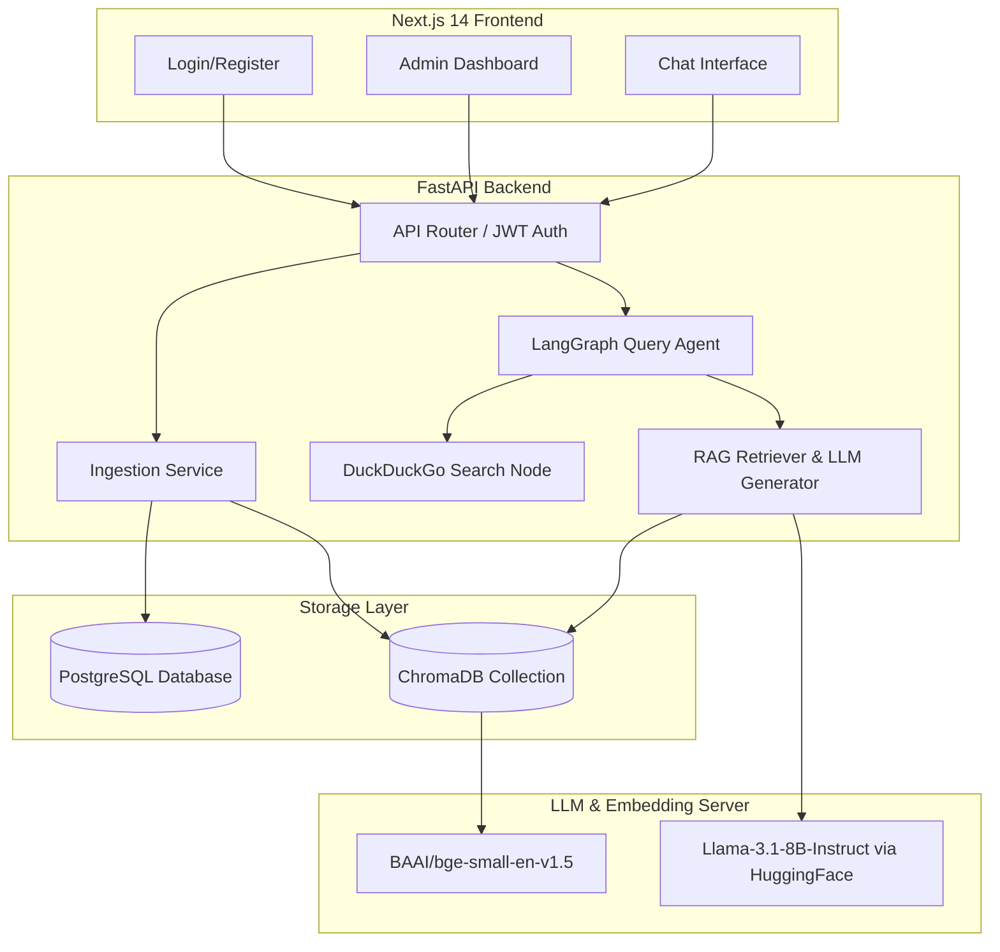

# Ticket Intelligence Platform - Walkthrough

Welcome to the walkthrough of the **Ticket Intelligence Platform**. This document provides an overview of the architecture, key components, database schema, data ingestion scripts, and RAG/Agent pipeline implemented in this project.

---

## 1. Overview & Core Features

The Ticket Intelligence Platform is a production-ready system designed to store, manage, and analyze support tickets and general knowledge documents. It features a RAG-powered chatbot interface that answers queries based on internal knowledge and falls back to web search when confidence is low.

### Core Capabilities
* **RAG-Powered Chatbot**: Multi-turn chat session management with server-sent event (SSE) streaming.
* **LangGraph Decision Agent**: Intelligent query routing that performs local vector retrieval first, evaluates result confidence, and conditionally queries the web.
* **Document Ingestion**: Parsing, chunking, and indexing of customer support datasets (CSV) and supplementary documents (PDF/TXT) using a local vector store.
* **Admin Dashboard**: Interfaces for uploading documents, monitoring ticket ingestion, executing database-to-vector store reindexing, and managing users.
* **Role-Based Access Control (RBAC)**: Secure access routes restricted to admins (e.g. ticket and document management) and users (e.g. chat sessions).

---

## 2. Architecture & Tech Stack



---

## 3. Directory Structure & Codebase Walkthrough

All key backend and frontend components are organized as follows:

### Backend Structure

* **FastAPI Entrypoint**:
  * [main.py](file:///c:/Users/mubee/Desktop/TechMahindra/backend/main.py): Sets up the FastAPI application factory, handles CORS, and registers the database and ChromaDB initialization lifespan context.

* **Configuration & Security**:
  * [core/config.py](file:///c:/Users/mubee/Desktop/TechMahindra/backend/core/config.py): Pydantic settings loading configuration from environmental files `.env` and `.env.local`.
  * [core/database.py](file:///c:/Users/mubee/Desktop/TechMahindra/backend/core/database.py): Configures the async SQLAlchemy database engine and session maker using `postgresql+asyncpg`.
  * [core/security.py](file:///c:/Users/mubee/Desktop/TechMahindra/backend/core/security.py): Utilities for password hashing (bcrypt) and JWT access/refresh token generation.
  * [core/dependencies.py](file:///c:/Users/mubee/Desktop/TechMahindra/backend/core/dependencies.py): FastAPI Dependency Injection functions (e.g., retrieving active db sessions, parsing current user, asserting role bounds).

* **Database Models**:
  * [models/base.py](file:///c:/Users/mubee/Desktop/TechMahindra/backend/models/base.py): Base class for declarative mapping containing automated table names and timestamps.
  * [models/user.py](file:///c:/Users/mubee/Desktop/TechMahindra/backend/models/user.py): Defines the `User` database model and `RefreshToken` tracking for JWT rotation.
  * [models/ticket.py](file:///c:/Users/mubee/Desktop/TechMahindra/backend/models/ticket.py): Implements schemas for tickets and their corresponding database-side embedding chunk records.
  * [models/chat.py](file:///c:/Users/mubee/Desktop/TechMahindra/backend/models/chat.py): Relational representation of chat sessions and chat messages with citations and scores.
  * [models/document.py](file:///c:/Users/mubee/Desktop/TechMahindra/backend/models/document.py): Relational definitions of uploaded raw document sources and chunks.

* **Data Access Repositories**:
  * [repositories/user_repo.py](file:///c:/Users/mubee/Desktop/TechMahindra/backend/repositories/user_repo.py): Performs SQL CRUD operations on users and refresh tokens.
  * [repositories/ticket_repo.py](file:///c:/Users/mubee/Desktop/TechMahindra/backend/repositories/ticket_repo.py): CRUD, bulk inserts, paginated querying, and metadata indexing logs for tickets.
  * [repositories/chat_repo.py](file:///c:/Users/mubee/Desktop/TechMahindra/backend/repositories/chat_repo.py): Manages database commits and fetches for chat session structures and stream histories.
  * [repositories/document_repo.py](file:///c:/Users/mubee/Desktop/TechMahindra/backend/repositories/document_repo.py): Manages document and chunk model instances in PostgreSQL.

* **Services (Business Logic)**:
  * [services/auth_service.py](file:///c:/Users/mubee/Desktop/TechMahindra/backend/services/auth_service.py): Handles registration, credential verification, token creation, and logout.
  * [services/user_service.py](file:///c:/Users/mubee/Desktop/TechMahindra/backend/services/user_service.py): Orchestrates password resets, role updates, and list/detail operations.
  * [services/ticket_service.py](file:///c:/Users/mubee/Desktop/TechMahindra/backend/services/ticket_service.py): CSV file validation, parsing, and pipeline triggering.
  * [services/chat_service.py](file:///c:/Users/mubee/Desktop/TechMahindra/backend/services/chat_service.py): Drives query agent execution and updates persistent records.
  * [services/document_service.py](file:///c:/Users/mubee/Desktop/TechMahindra/backend/services/document_service.py): Coordinates PDF/TXT parsing, chunking, and ChromaDB uploading.

* **API Routers**:
  * [api/router.py](file:///c:/Users/mubee/Desktop/TechMahindra/backend/api/router.py): Aggregates API routers into one unified entrypoint.
  * [api/auth.py](file:///c:/Users/mubee/Desktop/TechMahindra/backend/api/auth.py): Endpoint routes for registration, login, logout, and token refresh.
  * [api/chat.py](file:///c:/Users/mubee/Desktop/TechMahindra/backend/api/chat.py): Routes for chat session CRUD and streaming message endpoints.
  * [api/tickets.py](file:///c:/Users/mubee/Desktop/TechMahindra/backend/api/tickets.py): Routes for admin-only ticket uploads, queries, and vector store reindexing.
  * [api/documents.py](file:///c:/Users/mubee/Desktop/TechMahindra/backend/api/documents.py): Interface routes for document creation, removal, and listing.
  * [api/users.py](file:///c:/Users/mubee/Desktop/TechMahindra/backend/api/users.py): Endpoint actions to list users, promote roles, or toggle active flags.

* **RAG & LangGraph Components**:
  * [vectorstore/chroma_store.py](file:///c:/Users/mubee/Desktop/TechMahindra/backend/vectorstore/chroma_store.py): Manages connection sessions to persistent ChromaDB database directories.
  * [embeddings/embedding_service.py](file:///c:/Users/mubee/Desktop/TechMahindra/backend/embeddings/embedding_service.py): Wraps the SentenceTransformers embedding pipeline configured for the `bge-small-en-v1.5` model.
  * [ingestion/chunker.py](file:///c:/Users/mubee/Desktop/TechMahindra/backend/ingestion/chunker.py): Recursively chunks texts into custom sized token blocks.
  * [ingestion/ticket_loader.py](file:///c:/Users/mubee/Desktop/TechMahindra/backend/ingestion/ticket_loader.py): Standardizes multiple support dataset schema types into a unified ticket target format.
  * [ingestion/document_loader.py](file:///c:/Users/mubee/Desktop/TechMahindra/backend/ingestion/document_loader.py): Ingests TXT and PDF documents, creating chunk embeddings and saving meta records.
  * [rag/retriever.py](file:///c:/Users/mubee/Desktop/TechMahindra/backend/rag/retriever.py): Performs semantic retrieval against ChromaDB indices.
  * [rag/generator.py](file:///c:/Users/mubee/Desktop/TechMahindra/backend/rag/generator.py): Configures API requests to the HuggingFace Inference API (`Llama-3.1-8B-Instruct`) for answer synthesis.
  * [rag/prompts.py](file:///c:/Users/mubee/Desktop/TechMahindra/backend/rag/prompts.py): System and instruction prompt templates for RAG and search synthesizers.
  * [agents/query_agent.py](file:///c:/Users/mubee/Desktop/TechMahindra/backend/agents/query_agent.py): Defines the unified LangGraph workflow graph structure.
  * [agents/nodes.py](file:///c:/Users/mubee/Desktop/TechMahindra/backend/agents/nodes.py): Implements custom graph decision and execution node logic.
  * [agents/web_search.py](file:///c:/Users/mubee/Desktop/TechMahindra/backend/agents/web_search.py): Interfaces with DuckDuckGo Search APIs as a low-confidence fallback.

---

### Frontend Structure

* **Routing & Pages**:
  * [frontend/app/layout.tsx](file:///c:/Users/mubee/Desktop/TechMahindra/frontend/app/layout.tsx): Top-level layout providing routing bindings and global styling.
  * [frontend/app/page.tsx](file:///c:/Users/mubee/Desktop/TechMahindra/frontend/app/page.tsx): Main entrypoint and navigation root.
  * [frontend/app/globals.css](file:///c:/Users/mubee/Desktop/TechMahindra/frontend/app/globals.css): Tailwind styles, design systems, and component setups.

* **UI Components**:
  * [frontend/components/chat/chat-input.tsx](file:///c:/Users/mubee/Desktop/TechMahindra/frontend/components/chat/chat-input.tsx): Form inputs with autoscaling text areas and command buttons.
  * [frontend/components/chat/chat-window.tsx](file:///c:/Users/mubee/Desktop/TechMahindra/frontend/components/chat/chat-window.tsx): Message flow viewer supporting markdown renders, loader tickers, and citations.
  * [frontend/components/chat/session-sidebar.tsx](file:///c:/Users/mubee/Desktop/TechMahindra/frontend/components/chat/session-sidebar.tsx): Side column listing historical chat logs, offering options to delete or rename them.

---

### Scripts

* [scripts/seed_admin.py](file:///c:/Users/mubee/Desktop/TechMahindra/scripts/seed_admin.py): Automates the creation of an initial admin user (`admin@platform.local` / `Admin@1234`).
* [scripts/load_datasets.py](file:///c:/Users/mubee/Desktop/TechMahindra/scripts/load_datasets.py): Parses CSV tables placed in `data/tickets/` to populate ticket records.

---

## 4. Verification & Testing

Verify correctness and system uptime using the following processes:

### Running Setup

1. Configure variables:
   ```bash
   cp .env.example .env
   # Add your DATABASE_URL and HF_TOKEN values
   ```

2. Perform Alembic database migrations:
   ```bash
   cd backend
   alembic upgrade head
   ```

3. Populate database seeds and datasets:
   ```bash
   python ../scripts/seed_admin.py
   python ../scripts/load_datasets.py
   ```

4. Start FastAPI server:
   ```bash
   uvicorn main:app --reload
   ```

5. Run Next.js frontend:
   ```bash
   cd ../frontend
   npm run dev
   ```
