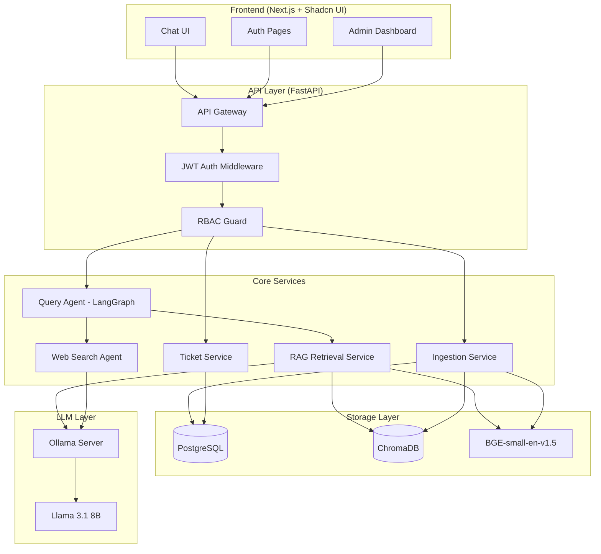
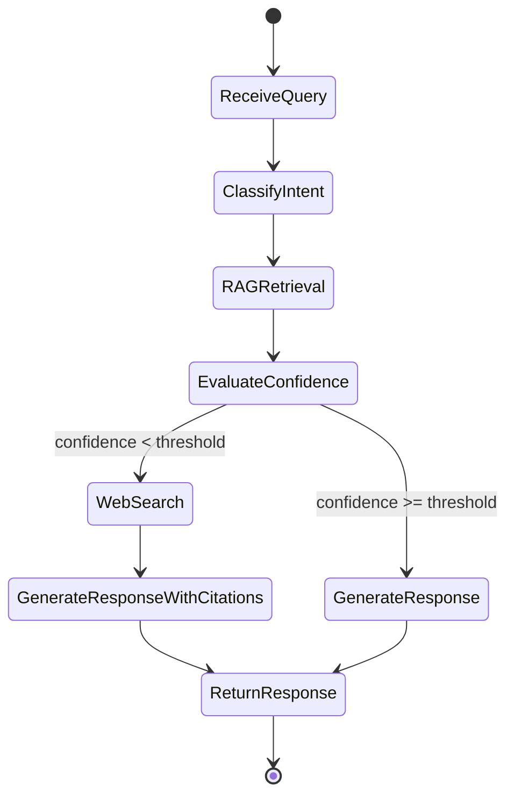
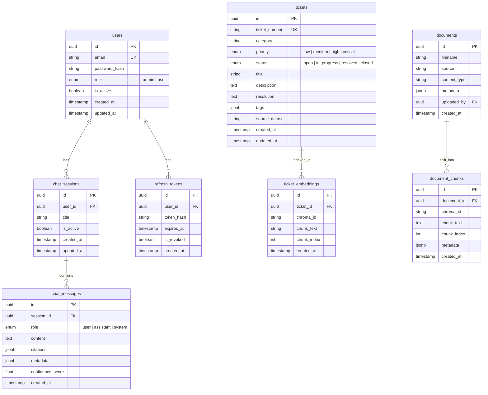

# Ticket Intelligence Platform — Implementation Plan

A production-ready system that stores/analyzes support tickets, builds a knowledge base, provides a RAG-powered chatbot UI with Ollama + Llama 3.1 8B, and falls back to web search when internal knowledge is insufficient.

---

## System Architecture



### Query Flow (LangGraph Workflow)



---

## ER Diagram



---

## Database Schema (SQL)

```sql
-- Enable UUID extension
CREATE EXTENSION IF NOT EXISTS "uuid-ossp";

-- Users table
CREATE TABLE users (
    id UUID PRIMARY KEY DEFAULT uuid_generate_v4(),
    email VARCHAR(255) UNIQUE NOT NULL,
    password_hash VARCHAR(255) NOT NULL,
    role VARCHAR(20) NOT NULL DEFAULT 'user' CHECK (role IN ('admin', 'user')),
    is_active BOOLEAN NOT NULL DEFAULT TRUE,
    created_at TIMESTAMP WITH TIME ZONE DEFAULT NOW(),
    updated_at TIMESTAMP WITH TIME ZONE DEFAULT NOW()
);

-- Refresh tokens (for JWT rotation)
CREATE TABLE refresh_tokens (
    id UUID PRIMARY KEY DEFAULT uuid_generate_v4(),
    user_id UUID NOT NULL REFERENCES users(id) ON DELETE CASCADE,
    token_hash VARCHAR(255) NOT NULL,
    expires_at TIMESTAMP WITH TIME ZONE NOT NULL,
    is_revoked BOOLEAN NOT NULL DEFAULT FALSE,
    created_at TIMESTAMP WITH TIME ZONE DEFAULT NOW()
);
CREATE INDEX idx_refresh_tokens_user_id ON refresh_tokens(user_id);
CREATE INDEX idx_refresh_tokens_token_hash ON refresh_tokens(token_hash);

-- Chat sessions
CREATE TABLE chat_sessions (
    id UUID PRIMARY KEY DEFAULT uuid_generate_v4(),
    user_id UUID NOT NULL REFERENCES users(id) ON DELETE CASCADE,
    title VARCHAR(255) DEFAULT 'New Chat',
    is_active BOOLEAN NOT NULL DEFAULT TRUE,
    created_at TIMESTAMP WITH TIME ZONE DEFAULT NOW(),
    updated_at TIMESTAMP WITH TIME ZONE DEFAULT NOW()
);
CREATE INDEX idx_chat_sessions_user_id ON chat_sessions(user_id);

-- Chat messages
CREATE TABLE chat_messages (
    id UUID PRIMARY KEY DEFAULT uuid_generate_v4(),
    session_id UUID NOT NULL REFERENCES chat_sessions(id) ON DELETE CASCADE,
    role VARCHAR(20) NOT NULL CHECK (role IN ('user', 'assistant', 'system')),
    content TEXT NOT NULL,
    citations JSONB DEFAULT '[]',
    metadata JSONB DEFAULT '{}',
    confidence_score FLOAT,
    created_at TIMESTAMP WITH TIME ZONE DEFAULT NOW()
);
CREATE INDEX idx_chat_messages_session_id ON chat_messages(session_id);
CREATE INDEX idx_chat_messages_created_at ON chat_messages(created_at);

-- Tickets
CREATE TABLE tickets (
    id UUID PRIMARY KEY DEFAULT uuid_generate_v4(),
    ticket_number VARCHAR(50) UNIQUE NOT NULL,
    category VARCHAR(100),
    priority VARCHAR(20) DEFAULT 'medium' CHECK (priority IN ('low', 'medium', 'high', 'critical')),
    status VARCHAR(20) DEFAULT 'open' CHECK (status IN ('open', 'in_progress', 'resolved', 'closed')),
    title VARCHAR(500) NOT NULL,
    description TEXT,
    resolution TEXT,
    tags JSONB DEFAULT '[]',
    source_dataset VARCHAR(100),
    created_at TIMESTAMP WITH TIME ZONE DEFAULT NOW(),
    updated_at TIMESTAMP WITH TIME ZONE DEFAULT NOW()
);
CREATE INDEX idx_tickets_category ON tickets(category);
CREATE INDEX idx_tickets_priority ON tickets(priority);
CREATE INDEX idx_tickets_status ON tickets(status);

-- Ticket embeddings tracking
CREATE TABLE ticket_embeddings (
    id UUID PRIMARY KEY DEFAULT uuid_generate_v4(),
    ticket_id UUID NOT NULL REFERENCES tickets(id) ON DELETE CASCADE,
    chroma_id VARCHAR(255) NOT NULL,
    chunk_text TEXT NOT NULL,
    chunk_index INTEGER NOT NULL DEFAULT 0,
    created_at TIMESTAMP WITH TIME ZONE DEFAULT NOW()
);
CREATE INDEX idx_ticket_embeddings_ticket_id ON ticket_embeddings(ticket_id);

-- Documents
CREATE TABLE documents (
    id UUID PRIMARY KEY DEFAULT uuid_generate_v4(),
    filename VARCHAR(500) NOT NULL,
    source VARCHAR(255),
    content_type VARCHAR(100),
    metadata JSONB DEFAULT '{}',
    uploaded_by UUID REFERENCES users(id),
    created_at TIMESTAMP WITH TIME ZONE DEFAULT NOW()
);

-- Document chunks tracking
CREATE TABLE document_chunks (
    id UUID PRIMARY KEY DEFAULT uuid_generate_v4(),
    document_id UUID NOT NULL REFERENCES documents(id) ON DELETE CASCADE,
    chroma_id VARCHAR(255) NOT NULL,
    chunk_text TEXT NOT NULL,
    chunk_index INTEGER NOT NULL DEFAULT 0,
    metadata JSONB DEFAULT '{}',
    created_at TIMESTAMP WITH TIME ZONE DEFAULT NOW()
);
CREATE INDEX idx_document_chunks_document_id ON document_chunks(document_id);
```

---

## Folder Structure

```
ticket-intelligence-platform/
│
├── data/
│   ├── tickets/              # Downloaded public CSV datasets
│   ├── documents/            # Uploaded documents (PDFs, etc.)
│   ├── synthetic/            # Future synthetic data
│   └── exports/              # Exported data
│
├── backend/
│   ├── main.py               # FastAPI app entry point
│   ├── requirements.txt
│   ├── alembic.ini
│   ├── alembic/
│   │   ├── env.py
│   │   └── versions/
│   │
│   ├── core/
│   │   ├── __init__.py
│   │   ├── config.py         # Pydantic Settings (env vars)
│   │   ├── database.py       # Async SQLAlchemy engine + session
│   │   ├── security.py       # Password hashing, JWT encode/decode
│   │   └── dependencies.py   # FastAPI dependency injection
│   │
│   ├── models/
│   │   ├── __init__.py
│   │   ├── base.py           # SQLAlchemy DeclarativeBase
│   │   ├── user.py
│   │   ├── chat.py
│   │   ├── ticket.py
│   │   └── document.py
│   │
│   ├── schemas/
│   │   ├── __init__.py
│   │   ├── auth.py           # Login/Register/Token schemas
│   │   ├── user.py
│   │   ├── chat.py
│   │   ├── ticket.py
│   │   └── document.py
│   │
│   ├── repositories/
│   │   ├── __init__.py
│   │   ├── user_repo.py
│   │   ├── chat_repo.py
│   │   ├── ticket_repo.py
│   │   └── document_repo.py
│   │
│   ├── services/
│   │   ├── __init__.py
│   │   ├── auth_service.py
│   │   ├── user_service.py
│   │   ├── chat_service.py
│   │   ├── ticket_service.py
│   │   └── document_service.py
│   │
│   ├── api/
│   │   ├── __init__.py
│   │   ├── router.py         # Aggregates all routers
│   │   ├── auth.py           # /api/auth/*
│   │   ├── users.py          # /api/users/*
│   │   ├── chat.py           # /api/chat/*
│   │   ├── tickets.py        # /api/tickets/*
│   │   ├── documents.py      # /api/documents/*
│   │   └── admin.py          # /api/admin/*
│   │
│   ├── rag/
│   │   ├── __init__.py
│   │   ├── retriever.py      # ChromaDB query logic
│   │   ├── generator.py      # LLM response generation
│   │   └── prompts.py        # System prompts and templates
│   │
│   ├── agents/
│   │   ├── __init__.py
│   │   ├── query_agent.py    # LangGraph workflow definition
│   │   ├── web_search.py     # Web search fallback tool
│   │   └── nodes.py          # Graph nodes (classify, retrieve, generate)
│   │
│   ├── embeddings/
│   │   ├── __init__.py
│   │   └── embedding_service.py  # BGE-small-en-v1.5 wrapper
│   │
│   ├── vectorstore/
│   │   ├── __init__.py
│   │   └── chroma_store.py   # ChromaDB client management
│   │
│   └── ingestion/
│       ├── __init__.py
│       ├── ticket_loader.py  # CSV dataset loaders
│       ├── document_loader.py # PDF/text document loaders
│       └── chunker.py        # Text chunking strategies
│
├── frontend/
│   ├── package.json
│   ├── tsconfig.json
│   ├── tailwind.config.ts
│   ├── next.config.ts
│   │
│   ├── app/
│   │   ├── layout.tsx        # Root layout
│   │   ├── page.tsx          # Landing / redirect
│   │   ├── globals.css
│   │   ├── (auth)/
│   │   │   ├── login/page.tsx
│   │   │   └── register/page.tsx
│   │   ├── chat/
│   │   │   ├── layout.tsx    # Chat layout (sidebar + main)
│   │   │   ├── page.tsx      # New chat
│   │   │   └── [sessionId]/page.tsx
│   │   └── admin/
│   │       ├── layout.tsx
│   │       ├── page.tsx      # Dashboard
│   │       ├── tickets/page.tsx
│   │       ├── documents/page.tsx
│   │       └── users/page.tsx
│   │
│   ├── components/
│   │   ├── ui/               # Shadcn UI components
│   │   ├── chat/
│   │   │   ├── chat-input.tsx
│   │   │   ├── chat-message.tsx
│   │   │   ├── chat-window.tsx
│   │   │   └── session-sidebar.tsx
│   │   ├── admin/
│   │   │   ├── ticket-upload.tsx
│   │   │   ├── document-upload.tsx
│   │   │   └── user-management.tsx
│   │   └── shared/
│   │       ├── navbar.tsx
│   │       ├── loading.tsx
│   │       └── error-boundary.tsx
│   │
│   ├── lib/
│   │   ├── api-client.ts     # Axios/fetch wrapper with interceptors
│   │   ├── auth.ts           # Token management
│   │   └── utils.ts
│   │
│   ├── hooks/
│   │   ├── use-auth.ts
│   │   ├── use-chat.ts
│   │   └── use-sessions.ts
│   │
│   └── types/
│       ├── auth.ts
│       ├── chat.ts
│       └── ticket.ts
│
├── tests/
│   ├── backend/
│   │   ├── test_auth.py
│   │   ├── test_tickets.py
│   │   ├── test_chat.py
│   │   └── test_rag.py
│   └── frontend/
│       └── ... (Jest/Vitest tests)
│
├── docker/
│   ├── Dockerfile.backend
│   ├── Dockerfile.frontend
│   └── docker-compose.yml
│
├── scripts/
│   ├── seed_admin.py         # Create initial admin user
│   ├── load_datasets.py      # Download & load public datasets
│   └── reindex.py            # Rebuild ChromaDB index
│
├── docs/
│   ├── architecture.md
│   ├── api.md
│   └── setup.md
│
├── .env.example
├── .gitignore
└── README.md
```

---

## API Design

### Authentication (`/api/auth`)

| Method | Endpoint | Auth | Description |
|--------|----------|------|-------------|
| POST | `/api/auth/register` | Public | Register new user |
| POST | `/api/auth/login` | Public | Login, returns access + refresh tokens |
| POST | `/api/auth/refresh` | Refresh Token | Rotate tokens |
| POST | `/api/auth/logout` | Bearer | Revoke refresh token |

### Chat (`/api/chat`)

| Method | Endpoint | Auth | Description |
|--------|----------|------|-------------|
| GET | `/api/chat/sessions` | User | List user's chat sessions |
| POST | `/api/chat/sessions` | User | Create new session |
| GET | `/api/chat/sessions/{id}` | User | Get session with messages |
| DELETE | `/api/chat/sessions/{id}` | User | Delete session |
| POST | `/api/chat/sessions/{id}/messages` | User | Send message (SSE streaming response) |
| PATCH | `/api/chat/sessions/{id}` | User | Rename session |

### Tickets (`/api/tickets`)

| Method | Endpoint | Auth | Description |
|--------|----------|------|-------------|
| GET | `/api/tickets` | Admin | List tickets (paginated, filterable) |
| GET | `/api/tickets/{id}` | Admin | Get ticket detail |
| POST | `/api/tickets/upload` | Admin | Upload ticket CSV |
| POST | `/api/tickets/reindex` | Admin | Re-embed all tickets into ChromaDB |

### Documents (`/api/documents`)

| Method | Endpoint | Auth | Description |
|--------|----------|------|-------------|
| GET | `/api/documents` | Admin | List documents |
| POST | `/api/documents/upload` | Admin | Upload document (PDF/TXT) |
| DELETE | `/api/documents/{id}` | Admin | Delete document |

### Users (`/api/admin/users`)

| Method | Endpoint | Auth | Description |
|--------|----------|------|-------------|
| GET | `/api/admin/users` | Admin | List all users |
| PATCH | `/api/admin/users/{id}` | Admin | Update user role/status |
| DELETE | `/api/admin/users/{id}` | Admin | Deactivate user |

---

## Proposed Changes — Phased Implementation

### Phase 1: Project Scaffold & Database

Set up the project skeleton, database models, migrations, and core configuration.

#### [NEW] backend/main.py
FastAPI application factory with CORS, lifespan events, and router mounting.

#### [NEW] backend/core/config.py
Pydantic `BaseSettings` class loading from `.env`: database URL, JWT secrets, Ollama host, ChromaDB path, etc.

#### [NEW] backend/core/database.py
Async SQLAlchemy engine + `async_sessionmaker` using `postgresql+asyncpg`.

#### [NEW] backend/core/security.py
`bcrypt` password hashing, JWT access/refresh token creation and verification using `python-jose`.

#### [NEW] backend/core/dependencies.py
FastAPI dependency functions: `get_db`, `get_current_user`, `require_role("admin")`.

#### [NEW] backend/models/*.py
All SQLAlchemy 2.0 `DeclarativeBase` models matching the ER diagram above.

#### [NEW] backend/schemas/*.py
Pydantic v2 request/response models for every endpoint.

#### [NEW] backend/alembic/ (init with async template)
`alembic init -t async alembic` → configure `env.py` to import all models and use the async DB URL.

---

### Phase 2: Authentication & User Management

#### [NEW] backend/repositories/user_repo.py
Database CRUD: `create_user`, `get_by_email`, `get_by_id`, `list_users`, `update_user`.

#### [NEW] backend/services/auth_service.py
Business logic: registration (hash password, check duplicates), login (verify password, issue tokens), refresh (rotate tokens, revoke old), logout.

#### [NEW] backend/api/auth.py
Routes: `POST /register`, `POST /login`, `POST /refresh`, `POST /logout`. No business logic in routes — delegates to `auth_service`.

#### [NEW] backend/api/users.py
Admin-only routes for user management.

#### [NEW] scripts/seed_admin.py
CLI script to create the initial admin user.

---

### Phase 3: Ticket Management & Data Loading

#### [NEW] backend/repositories/ticket_repo.py
CRUD + paginated listing + bulk insert from CSV datasets.

#### [NEW] backend/services/ticket_service.py
Business logic for ticket operations, CSV parsing, and validation.

#### [NEW] backend/api/tickets.py
Routes: list, get, upload CSV. Admin-only.

#### [NEW] backend/ingestion/ticket_loader.py
Adapters for the 4 public datasets. Each adapter maps dataset-specific columns to our unified `tickets` schema:
- **Kaggle IT Support**: maps `Ticket text → description`, `Priority → priority`, `Department → category`
- **Customer Support**: maps `Ticket Description → description`, `Status → status`, `Product → category`
- **Customer IT Support**: maps `Customer emails → description`, `Agent responses → resolution`, `Priority → priority`
- **MindWeave ITSM**: maps per its schema to our unified fields

#### [NEW] scripts/load_datasets.py
Script that downloads datasets (user provides CSV files in `data/tickets/`) and runs ingestion.

---

### Phase 4: Embeddings & Vector Store (ChromaDB)

#### [NEW] backend/embeddings/embedding_service.py
Wrapper around `SentenceTransformerEmbeddingFunction` with `BAAI/bge-small-en-v1.5`. Singleton pattern for model reuse.

#### [NEW] backend/vectorstore/chroma_store.py
ChromaDB `PersistentClient` manager with collections: `ticket_knowledge_base` and `document_knowledge_base`. Methods: `add_documents`, `query`, `delete`, `reset`.

#### [NEW] backend/ingestion/chunker.py
Smart text chunking with `RecursiveCharacterTextSplitter` (from LangChain). Configurable chunk size (512 tokens) and overlap (50 tokens).

#### [NEW] backend/ingestion/document_loader.py
PDF + text file loader. Extracts text, chunks it, embeds, and stores in ChromaDB.

---

### Phase 5: RAG Pipeline & LangGraph Agent

#### [NEW] backend/rag/prompts.py
System prompt templates:
- **Ticket expert prompt**: instructs the LLM to answer based on retrieved ticket knowledge
- **Web search synthesis prompt**: instructs the LLM to synthesize web results with citations
- **Confidence evaluation prompt**: asks the LLM to self-assess retrieval relevance

#### [NEW] backend/rag/retriever.py
Queries ChromaDB, returns top-K relevant chunks with metadata and distance scores.

#### [NEW] backend/rag/generator.py
Calls `ChatOllama(model="llama3.1:8b")` with the retrieved context + user query. Handles streaming via `astream`.

#### [NEW] backend/agents/nodes.py
Individual LangGraph nodes:
- `classify_intent`: Determines if the query is ticket-related, general knowledge, or greeting
- `rag_retrieve`: Calls the retriever, attaches context to state
- `evaluate_confidence`: Checks distance scores + LLM self-assessment; sets `needs_web_search` flag
- `generate_response`: Generates final answer from RAG context
- `web_search`: Calls DuckDuckGo search (free, no API key needed), returns results with URLs
- `generate_with_citations`: Generates answer from web results, includes source citations

#### [NEW] backend/agents/web_search.py
DuckDuckGo search tool wrapper using `duckduckgo-search` library. Falls back gracefully on errors.

#### [NEW] backend/agents/query_agent.py
LangGraph `StateGraph` definition:
```
START → classify_intent → rag_retrieve → evaluate_confidence
    → (confident) → generate_response → END
    → (not confident) → web_search → generate_with_citations → END
```
Uses `MemorySaver` for conversation state persistence.

---

### Phase 6: Chat API (Streaming)

#### [NEW] backend/repositories/chat_repo.py
CRUD for sessions and messages.

#### [NEW] backend/services/chat_service.py
Orchestrates: create session → invoke LangGraph agent → stream response via SSE → save messages to DB.

#### [NEW] backend/api/chat.py
Routes with SSE (Server-Sent Events) streaming for real-time token delivery:
- `POST /sessions/{id}/messages` returns `EventSourceResponse` that streams tokens as they're generated.

---

### Phase 7: Frontend (Next.js + Shadcn UI)

#### [NEW] frontend/ (initialized via `npx create-next-app@latest`)
Next.js 14+ App Router with TypeScript and Tailwind CSS.

#### [NEW] frontend/components/ui/ (via `npx shadcn@latest add ...`)
Shadcn components: `button`, `input`, `textarea`, `scroll-area`, `avatar`, `card`, `dialog`, `dropdown-menu`, `badge`, `table`, `tabs`, `toast`.

#### [NEW] Auth pages
`app/(auth)/login/page.tsx` and `register/page.tsx` — clean, modern forms with validation.

#### [NEW] Chat interface
- **Session sidebar**: List of chat sessions with create/delete/rename
- **Chat window**: Scrollable message list with streaming token display
- **Chat input**: Auto-resizing textarea with send button
- **Message bubbles**: User/assistant differentiation with avatar, markdown rendering, citation links

#### [NEW] Admin dashboard
- **Ticket upload**: Drag-and-drop CSV upload with progress
- **Document upload**: Multi-file upload with metadata
- **User management**: Table with role editing and deactivation
- **Reindex trigger**: Button to rebuild ChromaDB index

#### [NEW] frontend/lib/api-client.ts
Axios instance with interceptors for:
- Attaching Bearer token to requests
- Auto-refreshing tokens on 401
- Redirecting to login on auth failure

#### [NEW] frontend/hooks/
- `use-auth.ts`: Login/logout/register + token state
- `use-chat.ts`: SSE connection, message streaming, session management
- `use-sessions.ts`: Session CRUD

---

### Phase 8: Docker & DevOps

#### [NEW] docker/docker-compose.yml
Services:
- `postgres`: PostgreSQL 16 with volume persistence
- `chromadb`: ChromaDB server (or embedded via volume)
- `ollama`: Ollama server with Llama 3.1 8B pulled on startup
- `backend`: FastAPI app (depends on postgres, chromadb, ollama)
- `frontend`: Next.js app (depends on backend)

#### [NEW] docker/Dockerfile.backend
Multi-stage Python build. Installs dependencies, copies source, runs `uvicorn`.

#### [NEW] docker/Dockerfile.frontend
Multi-stage Node.js build. `npm install` → `npm run build` → serve with standalone output.

#### [NEW] .env.example
Template with all required environment variables.

---

## User Review Required

> [!IMPORTANT]
> **Dataset Loading**: The plan assumes you will manually download CSV files from Kaggle (requires a Kaggle account) and place them in `data/tickets/`. The ingestion scripts will then parse and load them. Confirm this approach works for you.

> [!IMPORTANT]
> **Web Search Tool**: Using **DuckDuckGo** (via `duckduckgo-search` Python library) as the web search fallback — it's free, requires no API key, and works well for production. An alternative would be **Tavily** (paid, higher quality results). Which do you prefer?

> [!WARNING]
> **Ollama Requirement**: The system requires Ollama running locally or in Docker with the `llama3.1:8b` model pulled (~4.7GB). Ensure your machine has sufficient RAM (≥16GB recommended).

## Open Questions

> [!IMPORTANT]
> 1. **Registration Policy**: Should user registration be open (self-signup) or admin-only (invite system)?
> 2. **Chat Streaming**: Should we use SSE (Server-Sent Events) or WebSockets for chat streaming? SSE is simpler and sufficient for one-directional streaming; WebSockets allow bidirectional but add complexity.
> 3. **ChromaDB Deployment**: Embedded (in-process with FastAPI) or standalone server (via Docker)? Embedded is simpler for development; standalone scales better.

---

## Verification Plan

### Automated Tests
```bash
# Backend unit tests
cd backend && pytest tests/ -v

# Backend API integration tests
cd backend && pytest tests/ -v --run-integration

# Frontend tests
cd frontend && npm test
```

### Manual Verification
1. **Auth flow**: Register → Login → Access protected routes → Refresh token → Logout
2. **Data ingestion**: Upload CSV → Verify tickets in DB → Verify embeddings in ChromaDB
3. **RAG chat**: Ask ticket-related question → Verify retrieval from ChromaDB → Confirm accurate LLM response
4. **Web search fallback**: Ask question outside ticket domain → Verify web search triggers → Confirm citations in response
5. **Admin dashboard**: Upload tickets, manage users, trigger reindex
6. **Docker**: `docker compose up` → All services start and communicate correctly
